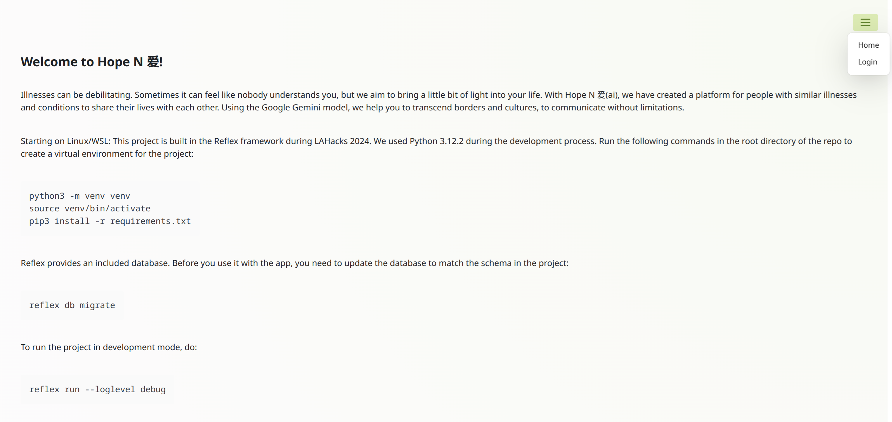
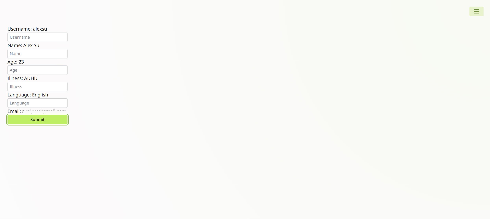
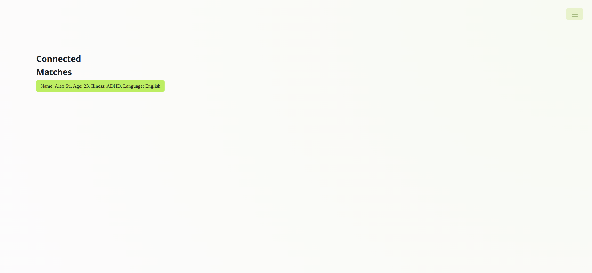
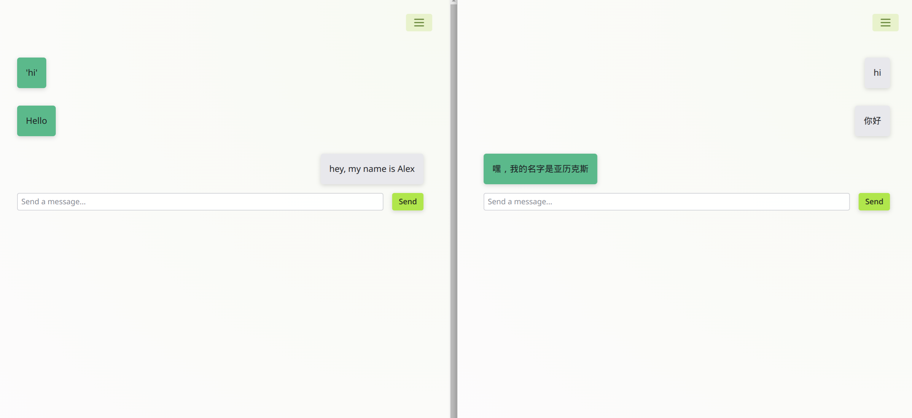

# Welcome to Hope N 爱!

Illnesses can be debilitating. Sometimes it can feel like nobody understands you, but we aim to bring a little bit of light into your life. With Hope N 爱(ai), we have created a platform for people with similar illnesses and conditions to share their lives with each other. Using the Google Gemini model, we help you to transcend borders and cultures, to communicate without limitations.

Starting on Linux/WSL:
This project is built in the Reflex framework during LAHacks 2024. We used Python 3.12.2 during the development process.
Run the following commands in the root directory of the repo to create a virtual environment for the project:
```
python3 -m venv venv
source venv/bin/activate
pip3 install -r requirements.txt
```

Reflex provides an included database. Before you use it with the app, you need to update the database to match the schema in the project:
```
reflex db migrate
```

To run the project in development mode, do:
```
reflex run --loglevel debug
```
# Features
## Home page


## Dashboard


## Available matches


## Chat room with translation service

